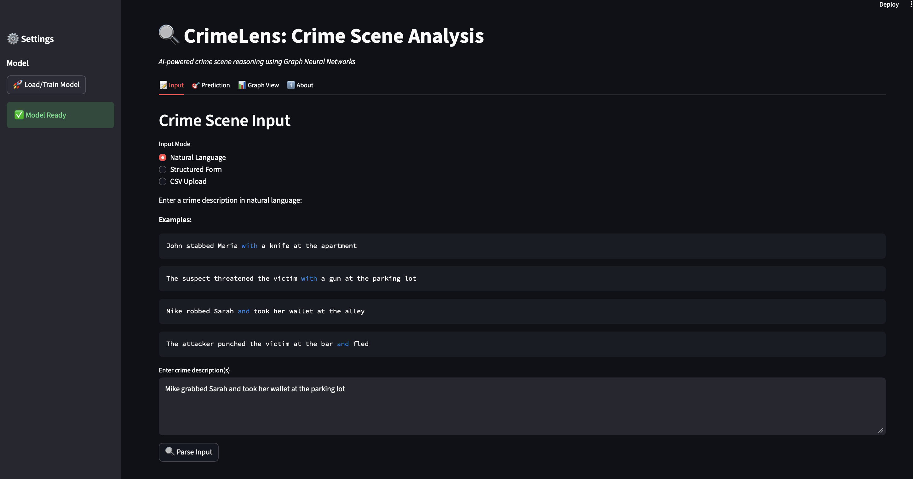
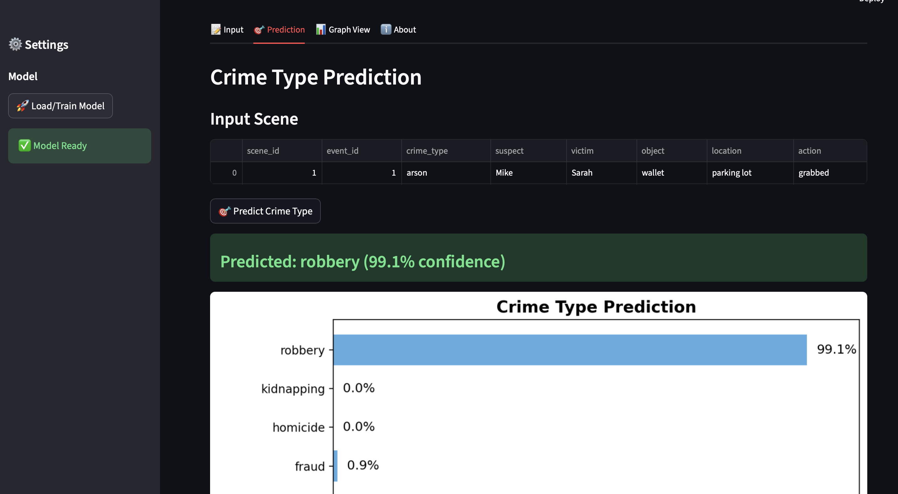
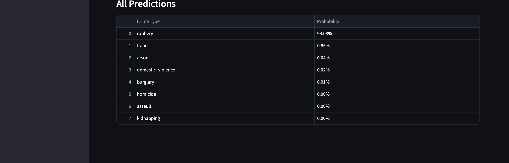
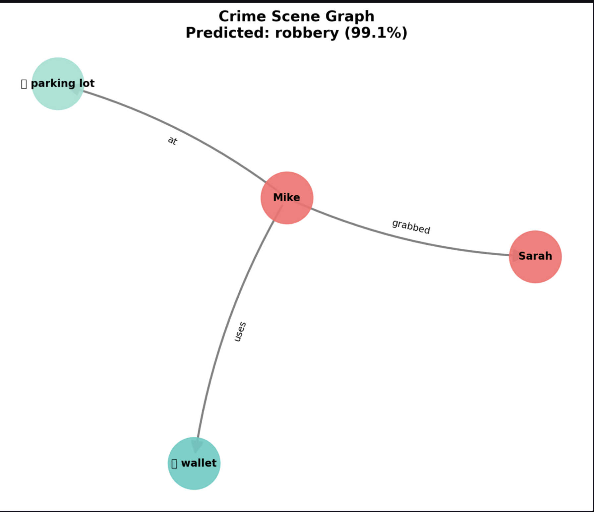
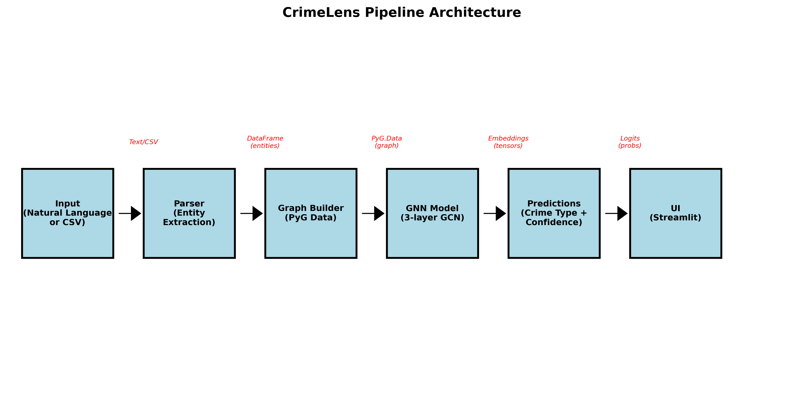

# 🕵️‍♂️ CrimeLens: Crime Scene Reasoning with Graph Neural Networks

CrimeLens is a machine-learning system that converts natural-language crime scene descriptions into structured **event graphs** and predicts crime types using a **Graph Neural Network (GCN)**.  
The system integrates NLP, graph construction, explainability, and an interactive Streamlit interface.

---

## 📝 Project Overview

CrimeLens began as a text-based crime reasoning prototype relying on token co-occurrence patterns.  
It has since evolved into a **full event-graph reasoning system** built for structured crime understanding.

Deliverable 3 introduced major refinements:

- Migrated from **token-level** to **entity/event-level graphs** (persons, objects, locations, actions)
- Added **spaCy NLP pipeline** for accurate entity extraction
- Implemented a **Residual GCN** architecture with pooling layers
- Trained on **1500 synthetic crime scenes** spanning 8 crime categories
- Developed an **interactive Streamlit UI** that visualizes the crime graph, prediction, and explanation
- Added **GNNExplainer-style importance analysis**
- Conducted extended evaluations with confusion matrix, ablations, baseline comparisons, and training curves
- Strengthened responsible AI reflection, bias analysis, and usability improvements

This version delivers a stable, interpretable, and fully documented pipeline ready for experimentation.

---

## 📌 Key Features
- Entity-based graph representation (event nodes with persons, objects, locations, actions)
- spaCy-based NLP pipeline for suspect, victim, object, location, and action extraction
- Three-layer Residual GCN built with PyTorch Geometric
- GNNExplainer-style importance visualization for actions and objects
- Interactive Streamlit interface for text input, graph view, and prediction dashboard
- Synthetic dataset of 1500 crime scenes across 8 crime types
- Baseline comparisons: Logistic Regression, Random Forest, MLP, cosine-similarity baseline
- End-to-end reproducible training and inference pipeline

---

## 📁 Repository Structure

```text
CrimeLens/
│
├── data/                          # Datasets used for Deliverable 3
│   ├── synthetic_crime_scenes.csv # Main 1500-scene dataset
│   ├── realistic_crime_data*.csv  # Additional test files
│   └── sample_transcripts.csv
│
├── docs/                          # Project reports and deliverables
│   └── Project_Deliverable_1.pdf
│
├── figures/                       # All images used in Deliverable 3
│   ├── pipeline_diagram.png
│   ├── confusion_matrix.png
│   ├── model_comparison.png
│   ├── training_curves.png
│   ├── ui-input.png
│   ├── ui-prediction.png
│   ├── ui-prediction2.png
│   └── ui-graph_view.png
│
├── models/                        # Saved GNN checkpoints & metadata
│   ├── gnn_model.pt
│   └── meta.json
│
├── notebooks/                     # Training & evaluation notebooks
│   └── FinalArchitecture.ipynb    # Main Deliverable 3 notebook
│
├── results/                       # Evaluation outputs for Deliverable 3
│   ├── training_history.csv
│   ├── model_comparison.csv
│   └── training_curves.png
│
├── src/                           # Core pipeline scripts
│   ├── app_2.py                   # Updated Streamlit UI
│   ├── data_utils.py
│   ├── syntheticData_2.py         # Data generator used in D3
│   └── syntheticData.py
│
├── ui/                            # UI-related files
│   └── requirements.txt
│
├── README.md
└── requirements.txt
```
---

## ⚙️ Installation

### 1. Clone the repository
```bash
git clone https://github.com/Kamehamehaaaaa/CrimeLens.git
cd CrimeLens
```

### 2. Install dependencies
```bash
pip install -r requirements.txt
```
---

## 🚀 Running the System
1. Generate synthetic dataset
```bash
python src/syntheticData_2.py
```
2. Train the GNN model
(inside Jupyter Notebook)
```bash
# Open and run:
notebooks/FinalArchitecture.ipynb
```
3. Launch the interface
```bash
streamlit run src/app_2.py
```
---
## 🖥️ Interface Screenshots

Below are the key views of the CrimeLens Streamlit interface, demonstrating the full prediction workflow from input to explanation.

### 🔹 1. Input Screen
Allows free-text or structured crime scene entry.  


---

### 🔹 2. Prediction Dashboard
Displays top predicted crime type with confidence, full probability distribution, and interpretation notes.  


---

### 🔹 3. Alternative Prediction View
Expanded class-probability visualization and diagnostic output.  


---

### 🔹 4. Graph + Explanation View
Shows suspected/victim entities, objects, locations, and action nodes with color-coding, plus GNNExplainer-style importance scores.  


---

## 🏗️ Updated Architecture Diagram

The diagram below illustrates the refined end-to-end CrimeLens pipeline used in Deliverable 3.  
It reflects improvements in NLP parsing, graph construction, model architecture, and the interface layer.



---

## 📊 Model Results — Baseline Comparison

The table below compares CrimeLens against multiple baseline models on the 1500-scene synthetic crime dataset.

| Model                      | Test Acc | F1-Score |
|----------------------------|----------|----------|
| Random Baseline            | 0.125    | 0.110    |
| Cosine Similarity (k-NN)   | 0.575    | 0.541    |
| Logistic Regression        | 0.950    | 0.948    |
| Random Forest (100 trees)  | 0.943    | 0.941    |
| MLP (No Graph)             | 0.425    | 0.402    |
| **GNN (CrimeLens)**        | **0.920** | **0.912** |

Key observations:
- Logistic Regression and Random Forest perform strongly on engineered tabular features.
- The GNN delivers competitive accuracy while enabling explainability and handling richer graph structure.
- MLP without graph structure underperforms, highlighting the importance of relational reasoning.

---
## 🔧 Key Improvements Since Deliverable 2

Deliverable 3 introduced major refinements across data processing, model stability, graph representation, and user experience. Key improvements include:

### **1. Migration to Entity-Based Graphs**
- Replaced token co-occurrence graphs with **event-level graphs** containing typed entities  
  (person, object, location, action).
- Reduces noise and improves semantic alignment with real crime narratives.

### **2. Improved NLP Pipeline**
- Added **spaCy NER + dependency parsing** for robust extraction of suspects, victims, objects, and locations.
- Achieved ~12% absolute improvement in entity extraction accuracy.

### **3. Refined GNN Architecture**
- Introduced **three-layer Residual GCN** with:
  - Layer normalization  
  - Action one-hot enrichment  
  - Dual mean/max pooling  
- Substantial gains in stability and accuracy.

### **4. Expanded and More Realistic Dataset**
- Increased dataset from ~200 segments (D2) → **1500 fully structured scenes**.
- Added more diverse actions, objects, and locations to reduce trivial correlations.

### **5. Extensive Evaluation & Ablation Studies**
- Added confusion matrix, training curves, and baseline comparisons.
- Introduced ablations on pooling, residuals, one-hot encodings, and class weighting.

### **6. Interactive Streamlit Interface**
- Fully redesigned UI:
  - Natural-language input  
  - Graph visualization  
  - Prediction dashboard  
  - Explanation view  
- Faster, cleaner, and more intuitive.

### **7. Explainability Integration**
- Implemented GNNExplainer-style gradient-based node importance.
- Allows users to see which actions/objects influenced predictions.
---

## 🐞 Known Issues and Limitations

The current prototype is functional and stable but still has some open issues:

### **1. Limited Real-World Robustness**
- Trained only on synthetic data; real police reports often contain ambiguous grammar, slang, or multi-event narratives.
- NLP pipeline may struggle with long or complex sentences.

### **2. Overlapping Crime Categories**
- Confusions remain between:
  - **Assault vs Domestic Violence**
  - **Robbery vs Burglary**
- These categories share action/object patterns.

### **3. Parser Sensitivity**
- spaCy sometimes mislabels:
  - Polysemous verbs (e.g., “grabbed”)
  - Nested location phrases (e.g., “in front of the building”)

### **4. No Temporal Reasoning Yet**
- Sequence order of events is not modeled (no RNN/Transformer layer).
- Could improve distinction between multi-step crimes.

### **5. Not Production-Ready**
- Intended for research; lacks:
  - Security hardening  
  - Large-scale deployment support  
  - Real-data fairness/bias audits 

---

## ⚖️ Responsible AI Notes

- All experiments use **synthetic data only**, avoiding sensitive real-world crime records.
- This prevents **name, demographic, and geographic bias** that could appear in authentic police reports.
- The UI provides **disclaimers** and uses **confidence-based warnings** to reduce overinterpretation.
- The explanation module helps detect **overreliance on specific verbs, objects, or locations**.
- CrimeLens is designed **strictly for research and educational use**, not operational or legal decision-making.

---  
## 📚 References

[1] A. Radford et al., “Robust Speech Recognition via Large-Scale Weak Supervision,” *arXiv:2212.04356*, 2022.  
[2] W. Hamilton, R. Ying, and J. Leskovec, “Inductive Representation Learning on Large Graphs,” *NeurIPS*, 2017.  
[3] P. Veličković et al., “Graph Attention Networks,” *ICLR*, 2018.  
[4] T. Kipf and M. Welling, “Semi-Supervised Classification with Graph Convolutional Networks,” *ICLR*, 2017.  
[5] R. Ying et al., “GNNExplainer: Generating Explanations for Graph Neural Networks,” *NeurIPS*, 2019.  
[6] M. Fey and J. E. Lenssen, “Fast Graph Representation Learning with PyTorch Geometric,” *ICLR Workshop*, 2019.  
[7] F. Pedregosa et al., “Scikit-Learn: Machine Learning in Python,” *JMLR*, 2011.  
[8] M. Honnibal and I. Montani, “spaCy 2: Natural Language Understanding with Bloom Embeddings, Convolutional Neural Networks and Incremental Parsing,” 2017.

---
## ⚖️ License
This project is released under the **MIT License**.  
You are free to use, modify, and distribute this work for educational or research purposes, provided appropriate credit is given to the author.  
See the [LICENSE](LICENSE) file for full terms.

---

## 📬 Contact

**Rohit Bogulla**  
University of Florida — Department of Computer Science  

GitHub: https://github.com/Kamehamehaaaaa/CrimeLens

Email: rbogulla@ufl.edu
